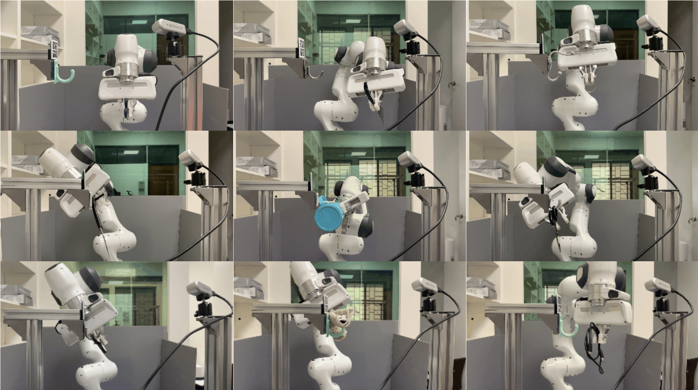

# SKT-Hang

- This GitHub repo is the implementation of the paper "SKT-Hang: Hanging Everyday Objects via Object-Agnostic Semantic Keypoint Trajectory Generation"



## System Requirements
- Linux (Teseted on Ubuntu 20.04)
- Python 3 (Tested on Python 3.7)
- Torch (Tested on Torch 1.13.1)
- Cuda (Tested on Cuda 11.8)
- GPU (Tested on Nvidia RTX3090, RTX4090)
- CPU (Tested on Intel COre i7-12700, Intel Xeon Silver 4210R)

## Setup
- Clone This Repo
```
$ git clone https://github.com/HCIS-Lab/SKT-Hang.git
```
- Create Conda Environment
```
$ cd SKT-Hang
$ conda create -n skt-hang python=3.7
$ conda activate skt-hang
$ pip install -r requirements.txt
```
- Install [PointNet++](https://github.com/erikwijmans/Pointnet2_PyTorch)
```
$ git clone https://github.com/erikwijmans/Pointnet2_PyTorch
$ cd Pointnet2_PyTorch
$ pip install -r requirements.txt
$ pip install -e .
```

## Dataset and Checkpoints
Download all the datasets, checkpoints, and shape assets [here](https://nycu1-my.sharepoint.com/:f:/g/personal/ychen_m365_nycu_edu_tw/Evo5W5e0uV1AiO5LWKmQH08BQU0ZjQDPfVRSMi9SD3nykg?e=C77qm3)

#### skt_dataset.zip
- Please unzip it and put all the folders in skt_dataset/ into dataset/ in this codebase.

#### all_checkpoints.zip
- Please unzip it and put all the checkpoint folders in all_checkpoints/ into src/checkpoints/ in this codebase.

#### all_shapes.zip
- Please unzip it and put all the shape folders in all_shapes/ into shapes/ in this codebase.

## Training and Inference

- Train SCTDN
```
$ cd src
$ ./run_sctdn.sh train
```

- Inference SCTDN
```
# You may need to modify the checkpoint path in this script
$ cd src
$ ./run_sctdn.sh inference
```

## File Structures
```
skt-hang/
    ├── config/
    │   ├── affordance/ # config yamls for training affordance prediction module
    │   ├── sctdn/ # config yamls for training SCTDN
    │   ├── vatmart/ # config yamls for vatmart
    │   └── modified_vatmart/ # config yamls for modified vatmart
    │
    ├── dataset/ # put all the dataset folders here
    │
    ├── shapes/ # put all the 3D shapes here
    │   ├── hook_all_new/ # all the supporting items
    │   ├── inference_objs_5/ # 5 objects for validation
    │   ├── inference_objs_50/ # 50 objects for testing
    │   └── wall/ # environment
    │
    └── src/ # all the source code
        ├── checkpoints/ # put all the checkpoints here
        ├── dataset/ # all the dataset modules
        ├── inference/ # for the inference results (.gifs, .pngs)
        └── models/ # all the network architectures (SCTDN, VAT-Mart, Modified Vat-Mart)
        ├── pybullet_robot_envs/ # robot manipulation framework
        ├── utils/ # useful tools and scripts
        ├── run_sctdn.py # for SCTDN training and inference
        ├── run_sctdn.sh # scripts for SCTDN training and inference
        ├── run_vatmart.py # for VAT-Mart training and inference
        ├── run_vatmart.sh # scripts for VAT-Mart training and inference
        ├── run_modified_vatmart.py # for Modified VAT-Mart training and inference
        └── run_modified_vatmart.sh # scripts for Modified VAT-Mart training and inference

```

## Citation
```
@article{skthang2023,
  title={SKT-Hang: Hanging Everyday Objects via Object-Agnostic Semantic Keypoint Trajectory Generation},
  author={Chia-Liang Kuo, Yu-Wei Chao, Yi-Ting Chen},
  year={2023},
  booktitle={arXiv},
}
```

